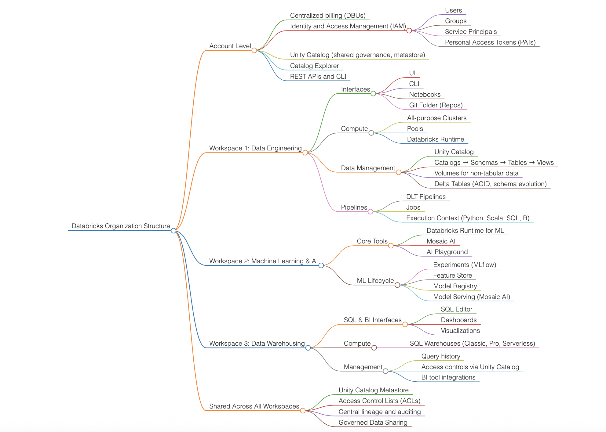

# 🧠 Databricks Platform Overview – Interactive Mindmap

This repository hosts an interactive **Databricks Organization Structure Mindmap**, covering key architectural layers and workspace components including:

- 🔐 Account-Level Governance
- 🛠️ Data Engineering
- 🤖 Machine Learning & AI
- 📊 Data Warehousing
- 🌐 Shared Governance with Unity Catalog

> 📍 **View the mindmap live**:  
> 👉 [https://genaigeek1.github.io/databricks/](https://genaigeek1.github.io/databricks/)  

---

## 💡 About

This mindmap is rendered using **Markmap**, a JavaScript-based tool for turning Markdown or JSON trees into dynamic, zoomable SVG mindmaps. It's ideal for:
- Enabling platform onboarding
- Communicating architecture to stakeholders
- Driving technical discovery sessions

## 📸 Mindmap Preview

## 🧰 Tech Stack

- HTML5 + CSS
- [Markmap.js](https://markmap.js.org/)
- GitHub Pages for hosting

---

## 📸 Screenshot

  
<!-- Optional: Replace with actual screenshot URL from your repo's `/assets` folder -->

---

## 🙋‍♂️ Author

**Saurabh Chhatwal**  
Principal Solutions Architect | Data & AI Strategist | GenAI Advocate  
[LinkedIn](https://www.linkedin.com/in/genaigeek/) | [GitHub](https://github.com/genaigeek1)

---

## 📝 License

This project is open-sourced for educational and knowledge-sharing purposes.
